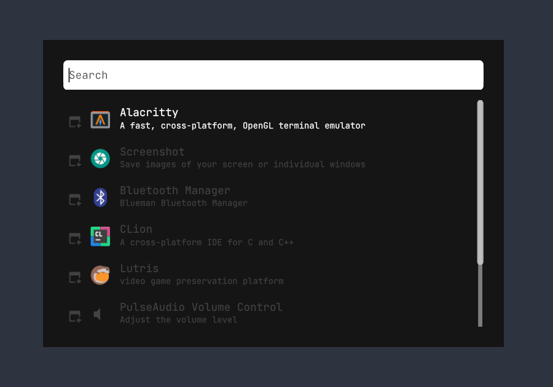
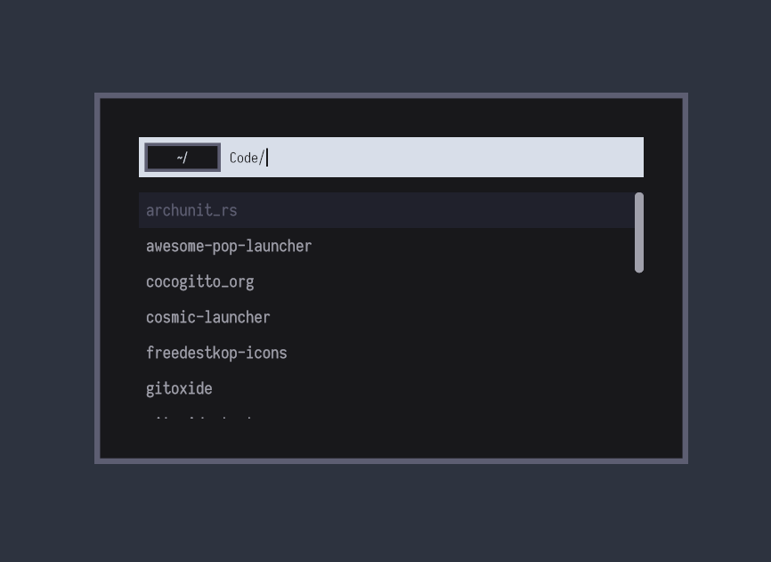
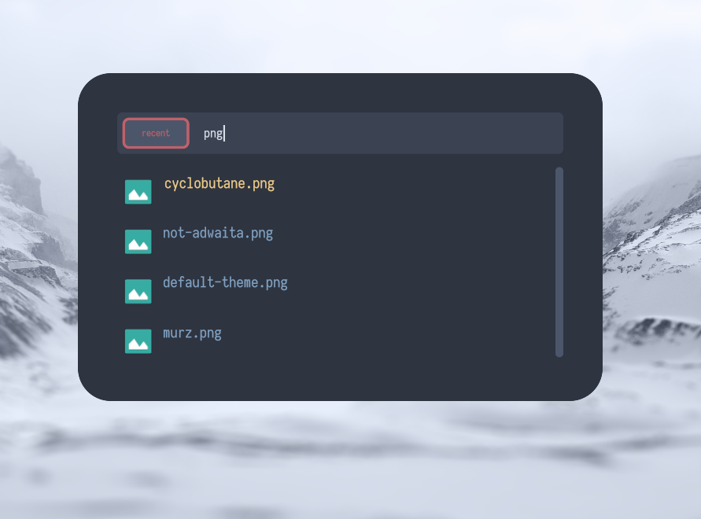
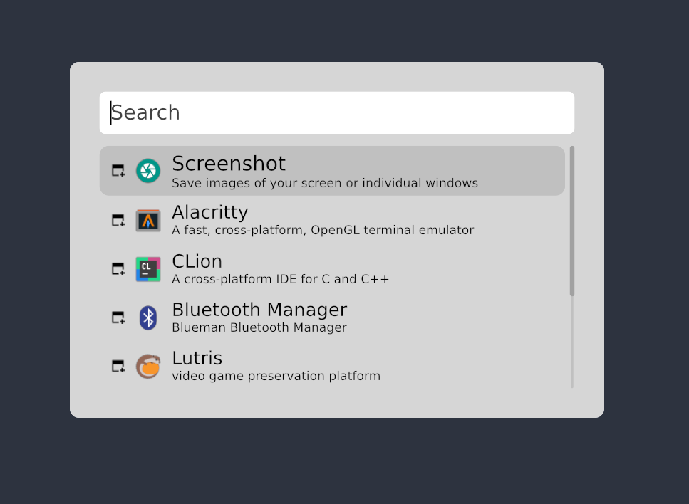
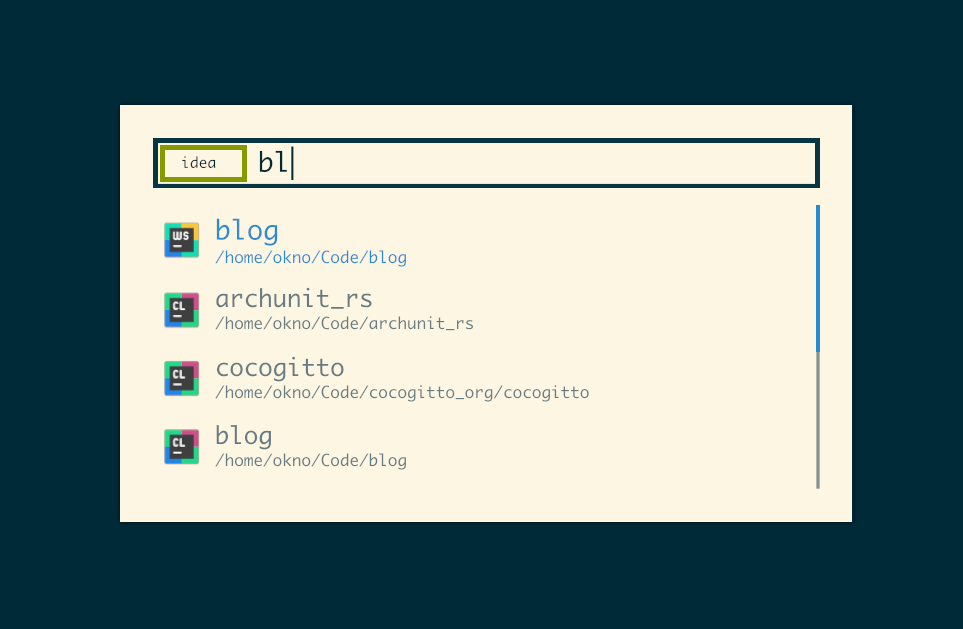
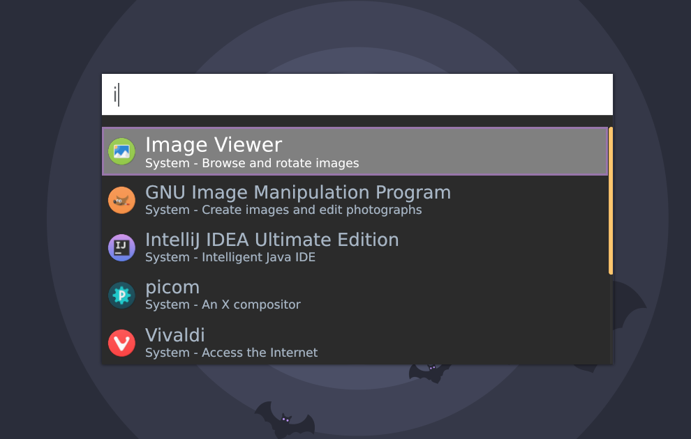
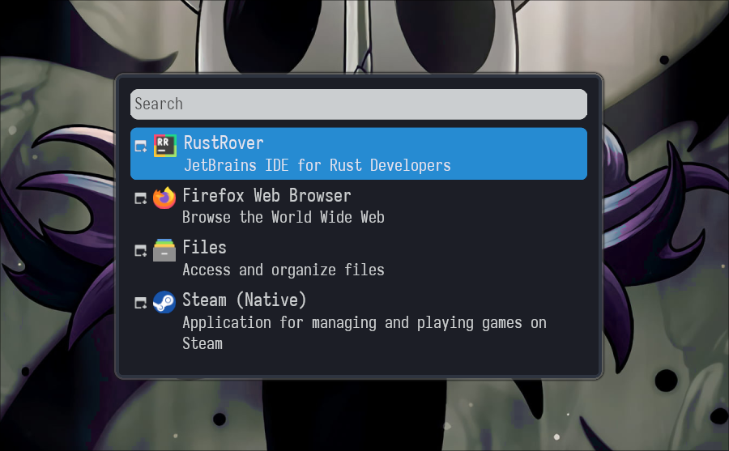

<p align="center">
  
</p>


<p align="center">
  <a href="https://github.com/onagre-launcher/onagre/actions/workflows/CD.yml"></a>
    </a>
  <br />
  <a href="https://conventionalcommits.org"
    ></a>
  <a href="https://github.com/onagre-launcher/onagre/actions/blob/main/LICENSE"
    ></a>
</p>

<p align="center">
  <a href="https://docs.onagre.dev">Website</a>
  ·
  <a href="https://docs.onagre.dev/get-started.html">Get Started</a>
</p>

<p align="center">
A general purpose application launcher for X and wayland  inspired <br>
by rofi/wofi and alfred,<br>
build with <a href ="https://github.com/hecrj/iced/">iced</a>
and <a href ="https://github.com/pop-os/launcher">pop-launcher</a>.
</p>


---

https://user-images.githubusercontent.com/24563836/170211716-7822ec0b-94d1-414e-a131-cf91af540ca4.mp4


Onagre is build on top of [pop-launcher](https://github.com/pop-os/launcher) which makes it very versatile.
The pop-launcher plugin system allow you to extend Onagre with plugins from the community or even write your own
using any programming language.

## Features

- Works on x11 and wayland.
- Fully customizable theme.
- Default plugins: calc, files, pop_shell, recent, terminal, desktop entries, find, pulse, scripts, web.
- Can be extended with [pop-launcher](https://github.com/pop-os/launcher) plugins.

## Install

**Dependencies:**
- ⚠️ [pop-launcher](https://github.com/pop-os/launcher) > 1.2.4
    **Rust 1.8 introduced a breaking change in the way sorting is handled, onagre will unexpectedly crash with older version of pop launcher.**
    **Currently, for arch users, the only way to get the latest version of pop-launcher is to build it from source.**
- [Qalculate](http://qalculate.github.io/) (optional)

[](https://repology.org/project/onagre/versions)

If there is no distro package available for Onagre in your preferred manager,
you need Rust and [cargo](https://doc.rust-lang.org/cargo/getting-started/installation.html) to build it.

**From source:**

```bash
git clone https://github.com/oknozor/onagre.git
cd onagre
cargo build --release --locked
sudo mv target/release/onagre /usr/bin/onagre
```

**Latest release with cargo:**

```bash
cargo install --git https://github.com/onagre-launcher/onagre --tag 1.0.0
```

**Latest upstream with cargo:**

```bash
cargo install --git https://github.com/onagre-launcher/onagre
```


## Usage

**1. Key bindings:**


| Key             | Action                       |
|:----------------|:-----------------------------|
| `Arrow up/down` | Change selection             |
| `Tab`           | Autocomplete (in files mode) |
| `Esc`           | Quit without launching       |
| `Enter`         | Launch selection             |

**2. Plugins:**

To use a plugin simply match its regex when typing your query.

For instance the `file` plugin will match `^(/|~).*`, typing `~/` would enable the plugin and start the file navigation.

Plugin with no prefix are enabled by default, there entry will be mixed in the search results.

**Default plugins:**

| Mode        | Description                                                   | Prefix           | Configuration                                            |
|:------------|:--------------------------------------------------------------|:-----------------|:---------------------------------------------------------|
| History     | Display the most used desktop entries on start                |                  |                                                          |
| PopLauncher | Search for desktop entries                                    |                  |                                                          |
| Pulse       | Control PulseAudio devices and volume                         |                  |                                                          |
| Script      | Shell scripts as launcher options                             |                  | `$HOME/.local/share/pop-launcher/scripts`                |
| Terminal    | Terminal or background commands                               | 'run '           |                                                          |
| Web         | Web search                                                    | 'ddg ', 'g', ... | `$HOME/.local/share/pop-launcher/plugins/web/config.ron` |
| Files       | Find files using fd/find                                      | 'find '          |                                                          |
| Recent      | Recently-opened document search                               | 'recent '        |                                                          |
| Calc        | Calculator with unit conversion (uses Qalculate! expressions) | '= '             |                                                          |
| Help        | List available pop-launcher modes                             | '?'              |                                                          |


## Theming

Onagre will look for a theme file in `$XDG_CONFIG_DIR/onagre/theme.scss` and will fallback to the default theme if none
is found or if your theme contains syntax errors. To ensure your theme is correctly formatted run `onagre` from the terminal.

For a detailed guide refer to [wiki -> theming](https://github.com/oknozor/onagre/wiki/Theming)
, or take a look at the [theme examples directory](docs/theme_examples).

## Gallery

---


*Default theme*

---


[*Murz*](docs/theme_examples/murz.scss) (credit to [murz](https://github.com/Murzchnvok/rofi-collection))

---


[*Nord*](docs/theme_examples/nord-rounded.scss)

---


[*Not-Adwaita*](docs/theme_examples/not-adwaita.scss)

---


[*Solarized*](docs/theme_examples/solarized.scss)

---


*Darcula*

---


*Hollow*

___


## Related projects

- [pop-launcher](https://github.com/pop-os/launcher)
- [pop-shell](https://github.com/pop-os/shell/)
- [cosmic-launcher](https://github.com/pop-os/cosmic-launcher)

## Code of conduct

This project is bound by a [code of conduct](CODE_OF_CONDUCT.md) based on the [contributor covenant](https://www.contributor-covenant.org/) if you are not familiar with it, and want to contribute please, read it before going further.

## Contributing

Having a question or suggestion for a new feature ? Feel free to open an issue or submit a PR.
Currently, what we need the most is feedback from users using different window managers and hardware.
If Onagre does not work out of the box for you *please let us know*, so we can fix it.

## License

All the code in this repository is released under the MIT License, for more information take a look at the [LICENSE](LICENSE) file.

## Thanks

Credit to [@themou3ad](https://github.com/themou3ad) for the logo!
