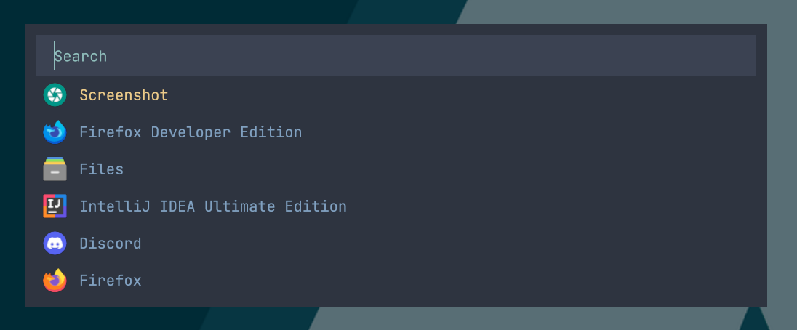
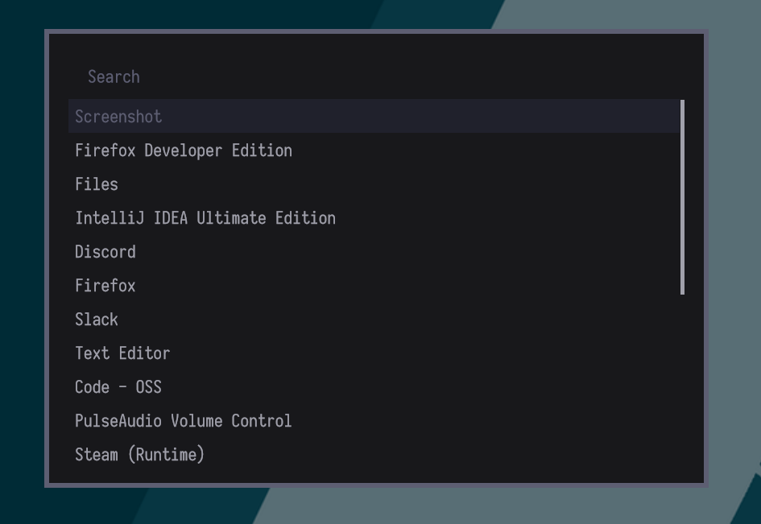
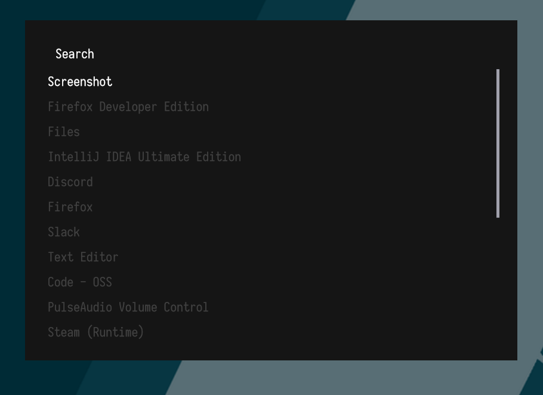
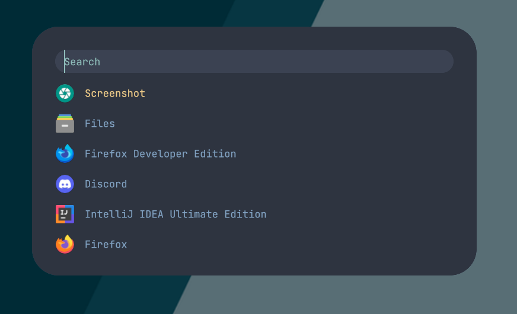
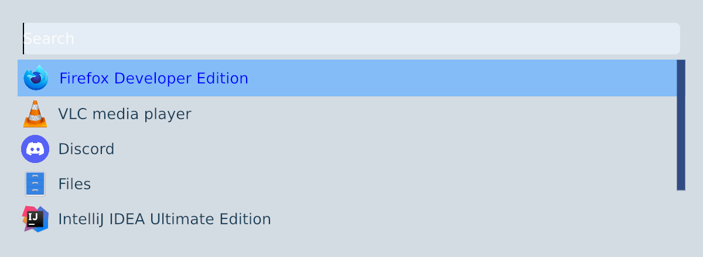
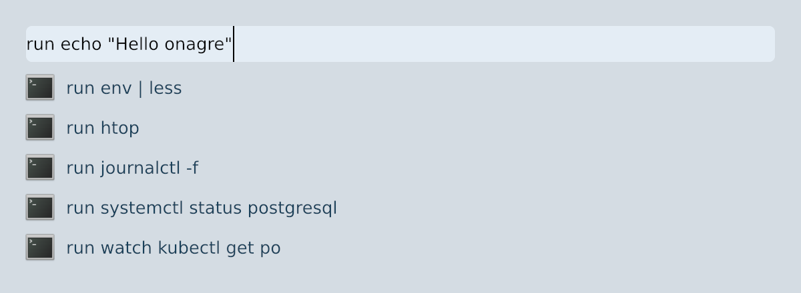
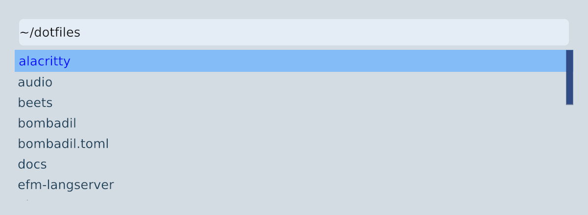

# Onagre 

Onagre is a general purpose application launcher for X and wayland  inspired by rofi/wofi and alfred and build with [iced](https://github.com/hecrj/iced/).



## Disclaimer 

⚠️️ Onagre is currently unreleased. 
Until the roadmap is completed, expect breaking changes, bugs and performance issues. ⚠️

## Difference with wofi/rofi

I built onagre for my main setup (sway/i3) as an alternative to [wofi](https://hg.sr.ht/~scoopta/wofi) so it's worth mentioning there are a few differences : 

- Window transparency.
- Rounded corners (even on sway).
- Several default plugins (thanks to pop-launcher)
- Change mode with prefix not rofi like modi.
  
## Install

**Dependencies** :
- [pop-launcher](https://github.com/pop-os/launcher) > 1.0.1 (for arch users there is and AUR package out there)
- [Qalculate](http://qalculate.github.io/) (optional)

**Installation:**

```bash
cargo install --git https://github.com/oknozor/onagre
```

## Usage

**1. Key bindings:**


| Key     | Action  | 
| :----   | :-----  |
| `Arrow up/down` | Change selection |
| `Tab`   | Autocomplete (in files mode) | 
| `Esc`   | Quit without launching | 
| `Enter` | Launch selection | 

**2. Modes:**

To change mode simply type the mode prefix followed by a space and a query. 
For example `ddg onagre launcher` will open a DuckDuckGo search query with your default browser.

Mode with no prefix are enabled by default, there entry will be mixed in the search results.

| Mode        | Description                                                   | Prefix          | Configuration                                             |
| :----       | :-----                                                        | :------         | :-----------                                              |
| History     | Display the most used desktop entries on start                |                 |                                                           |
| PopLauncher | Search for desktop entries                                    |                 |                                                           |
| Pulse       | Control PulseAudio devices and volume                         |                 |                                                           |
| Script      | Shell scripts as launcher options                             |                 | `$HOME/.local/share/pop-launcher/scripts`                 |
| Terminal    | Terminal or background commands                               | 'run'           |                                                           | 
| Web         | Web search                                                    | 'ddg', 'g', ... | `$HOME/.local/share/pop-launcher/plugins/web/config.ron`  |
| Files       | Find files using fd/find                                      | 'find'          |                                                           |
| Recent      | Recently-opened document search                               | 'recent'        |                                                           |
| Calc        | Calculator with unit conversion (uses Qalculate! expressions) | '='             |                                                           |
| External    | Shell command as launcher entries                             | configurable    | `$HOME/.config/onagre/config.toml`                        |
| Help        | List available pop-launcher modes                             | '?'             |                                                           |

## Configuration

### External mode

**1. Example:**

You can add mode from external commands like so: 

```toml
# Integrate `pass` password manager.
# Note that we need to run command in a subshell to escape double quotes and have env variables accessible.
[modes.pass]
source = "sh -c \"cd $HOME/.password-store && fd -t f . | sed s/\\.gpg//\""
# Execute this command on `enter` `%` will be replaced with the selected entry
target = "sh -c \"pass -c %\""
```

**2. Alternate config:**

You can provide alternate config and theme with the `--config` and `--theme` flags.
For more info run `onagre --help`.

## Theming

Onagre will look for a theme file in `$XDG_CONFIG_DIR/onagre/theme.toml` and will fall back to the default theme if none is found.

⚠ Until the theming API is stabilized you can take a look at [the examples](docs/theme_examples)

## Screenshots

[*Murz theme*](docs/theme_examples/murz-theme.toml) (credit to [murz](https://github.com/Murzchnvok/rofi-collection))


---
[*Simple theme*](docs/theme_examples/simple-theme.toml)

---

[*Nord rounded*](docs/theme_examples/nord-rounded.toml)





*History mode*



*Terminal mode*



*File mode*


## Roadmap

  - [x] default desktop entries launcher. 
  - [x] optional desktop icons.
  - [x] custom menu from external command.
  - [x] configurable styling.
  - [x] config from flag.
  - [x] prefix mode search (ex: type "de" to search for desktop entries).
  - [x] transparency 
  - [ ] packaging 
  - [ ] theme config stabilization

## Code of conduct

This project is bound by a [code of conduct](CODE_OF_CONDUCT.md) based on the [contributor covenant](https://www.contributor-covenant.org/) if you are not familiar with it, and want to contribute please, read it before going further.

## Contributing

Having a question or suggestion for a new feature ? Feel free to open an issue or submit a PR.
Currently, what we need the most is feedback from users using different window managers and hardware. 
If onagre does not work out of the box for you *please let us know* so we can fix it.

## License 

All the code in this repository is released under the MIT License, for more information take a look at the [LICENSE](LICENSE) file.
